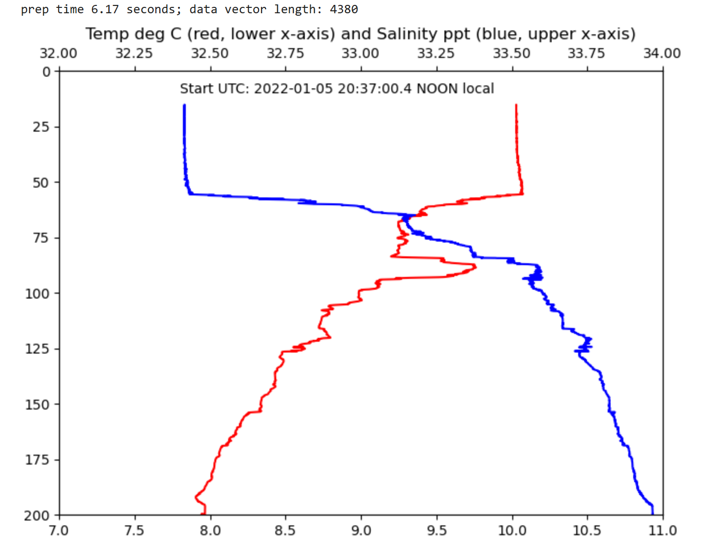

[nexus published](https://robfatland.github.io/nexus), [nexus index source](https://github.com/robfatland/nexus/blob/gh-pages/index.md), 
[data index source](https://github.com/robfatland/nexus/blob/gh-pages/data/index.md)


# api


The objective is to build an API that can return data from a NoSQL database.


- Version 1: The MSE544 [Periodic table exercise](#the-mse544-periodic-table)
- Version 2: The Cloud Clinic 2 [Ocean Observatory exercise](#ocean-observatory-data)


## The MSE544 periodic table

MSE544 is a data science course taught at the University of Washington by Professor Luna Huang. 
Part of the course covers skills for building research computing infrastructure on the public cloud.


- CosmosDB instance: `robs-data-ocean`
- Databases
    - `periodic-db`
        - Container: `elements`
    - `oceanography`
        - Container: `osb_profile`
        - Container: `osb_temp`
        - Container: `osb_salinity`


***For follow-along annotation (Periodic table of elements): Keep reading***


***For the oceanography segment: [Jump down in this document](#oceanography)***


This narrative follows the [MSE544 course activity](https://cloudbank-project.github.io/az-serverless-tutorial/) 
built as proof of concept on Azure. This data API builder does not make use of  
[***docker containerization***](https://naclomi.github.io/containers-tutorial/).


- Create an Azure NoSQL database and publish data
    - The Azure brand name for their NoSQL database service is "Cosmos DB"
- Create a serverless function (on Azure this is called a 'Function App')
    - Hosts a data API
    - Written in Python
    - Connects to the NoSQL database


For the Periodic Table demonstration we have three "working" milestones
- Get periodic table information for (say) Sodium using the Azure portal (browser tab) 
- Same query but using an API website; also on a browser tab but the Azure portal is not involved
    - This invokes the Azure Function App, a serverless function on the Azure cloud
- Same query run from code, specifically a Python program behaving as a *Client*
    - Use the Python `requests` library.
    - Here the Azure Function app plus the NoSQL database comprise the API *Server*
    - The result is a completely automated program-to-program data access procedure
        - This is something of a model for everything that happens on the internet
        - Underlying technology: A message passing protocol called `HTTP`. 


Two things to try and develop in passing are *debugging skills* and *underlying context*.


A note on process: 
This tutorial uses two virtual **workshops** (intentionally avoiding the word *environment*).
The first workshop is the `bash` shell running on a low-power, low-cost on-demand virtual machine (VM) on the 
Azure cloud. The second workshop is the **VSCode** application, a popular and free IDE available from 
Microsoft. Both `bash` on the VM and the VSCode application integrate well with the Azure cloud. 


## Set up a VM


## Build the NoSQL Database


This will be called `robs-data-ocean` and it is built on the Azure portal, being careful to check 
**Do not apply** on the "Free Tier Discount". And West US 2 (Moses Lake). Be sure as well to 
**Disable** both aspects of Global Distribution. 


> Not addressed: apt install of `pip` and `venv` was already done for (below, out of sequence)
> the Function App... in this case why no environment creation prior? Nothing about `PATH`.
> I decide to close this VSCode session and start clean... but as I already ran it there is
> nothing to be done in `sudo apt install -y` for `python` and `venv`. Ok... and
> `pip3 install -r requirements.txt` takes some time but is also ok.


Execute the loader Python script: 

```
python3 process.py periodic-table.csv
```

## debugging


While testing the database build steps I ran into an error during `python process.py periodic-table.csv`. 
It appeared to be a library import statement for `pandas`. Three debug procedures:


- copy/paste the error message or fractions thereof in the browser search window
    - Possibly helpful: prepend qualifiers like "Azure" or "Python"
    - This often finds related stack overflow (etc) pages
    - These may or may *not* be helpful; proceed with caution
- Create a simplified version of the program to isolate the error
    - Example: the error message cites a problem at line 12
    - Create a 12-line version of the program and see if this still gives the error
    - In this case there was some sort of arcane library incompatibility...
- Simplify `requirements.txt` and reinstall the environment
    - To get Python library version numbers for installed modules:
        - `pip show numpy` and the much simpler `pip list`
    - To uninstall: `pip uninstall -r requirements.txt`
    - To simplify the listing: `pandas==2.0.3` becomes simply `pandas`, and so on
    - To reinstall: `pip install -r requirements.txt`
    - The `process.py` file was restored to its intended content; and now ran to completion


Working with the continuously evolving collection of Python libraries can be a murky process.
Debugging steps such as described above are simple; and simple is a recommended way to start.


## Build the Azure Function App


- skip for now: multiple steps leading up to `Hey Galaxy` test code
- skip for now: In the interest of whatabout: Can we use a `conda` environment?


### Resuming a paused project


Suppose we have to step away for a few days: From a VM where we are working on 
some project. Some simple advance steps can facilitate smooth resumption: Use
the `.bashrc` and `.bash_aliases` to save configuration aliases and print a
message on how to resume using `echo`. 


- **Start** the VM for example from the portal or console
- Run `VSCode` and `ssh` into this VM
- In VSCode > terminal > read the login message
    - ...this reminds us of configuration aliases we set up before the hiatus
        - For example: activating an environment, moving to the working directory


#### the `robotron` alias


I use the alias `robotron` as it is eye-catching. Some Linux aliases are defined on 
login when the user's `bash` script `~/.bashrc` is automatically run.
This script also checks for and (if it exists) runs a sub-script called `~/.bash_aliases`. 
*That* is a good place to add custom aliases; and `echo` statements that remind us
of those aliases. For example: Add these at the end of `~/.bash_aliases`:

```
echo Use **robotron** to relocate and activate the development environment
alias robotron='cd ~/db-api; source app-env/bin/activate; func --version'
```


Test this:


```
source ~/.bashrc
```


### Testing the Function App on the VM


- `func --version` checks to see the Azure Function 
- `func start` starts the VM's version of the API
    - Azure Function core tools appropriates (forwards) my laptop's port 7071
        - result: `https://localhost:7071` connects to the test API running on the Azure VM
            - this test environment is not the Azure Function App
            - it is convenient to test the API before publishing it to the Azure cloud Function App


### Publish Function App to the Azure cloud 


- ***WARNING***: There is a bump in the road ahead.
    - Publication/test: If something goes wrong: ***Do Not Try To Debug The Problem***
    - Rather: Keep reading further in the instructions.
- Deploying the Function App to Azure
    - We log in to Azure from the Azure VM: `az login`
        - `az login` = {**azure command line interface** = `az`} +  {**action** = `login`}
        - The Azure VM session is authenticated to interact with the azure cloud
    - Publication command is `func azure functionapp publish <project-name>`
    - The publication load time is a bit slow: 5 minutes or so before the prompt returns
        - This is why localhost testing is good
            - Possible because database calls work from localhost
                - Example: `http://localhost:7071/api/lookup?name=Sodium` works
                - This is possible for two reasons:
                    - Port 7071 forwards from our laptop to the Azure VM
                    - The code running on the Azure VM includes credentials to access the NoSQL Periodic table database


### database access risk


We consider three aspects of risk:
- The Azure Function App database access credentials become public
- The credentials we install on the development VM become public
- The API itself becomes public


- On the first topic: Code published to Azure (in a Function App) is not visible to the outside world
    - The Function App does have database access credentials 'built in'
    - We can regard these as safe


- On the second topic: The code on the development VM contains two pieces of authentication information
    - `ACCOUNT_HOST` is the database ip address
    - `ACCOUNT_KEY` is the database access key
    - Neither of these should be openly visible to the world
    - Suppose I accidentally commit this code to GitHub: This is a big security hole
        - Be careful to set up `.gitignore` and test it with fake credentials
        - Remember that GitHub retains older versions of code
            - If credentials are compromised: Generate new credentials 


- Thoughts on the API being public
    - The periodic table example is a read-only API and the data is not privacy-sensitive
    - This represents low risk; the there are two reasons to consider securing it
        - A bot could maliciously use the API many times costing you money
        - You may envision future work where privacy *will* be important
        - You may envision future work where the database will continue to accumulate new data
    - The general way to secure an API is with a *token* or synonymously a *key*
        - In practice this is a very long (hundreds of characters) randomly generated password
    - Every approved API User will receive a token
        - They take great care not to publish this token for example to GitHub
    - In the event of an accidental breach of security: The API Administrator needs a means of easily disabling any token
    - This also implies tracking the status of each person to whom a token is assigned
    - The token is passed in every API request as an HTTP header (not as a URL variable)
        - This HTTP *header* comes along invisibly in the HTTP *request*
        - i.e. it does not appear after the "?" in the request URL
    - One *could* code the logic of token management into the Python server-side API program...
        - ...however Azure Function Apps has built-in machinery for this purpose...
        - ...so *that* is what we should use, for several reasons:
            - we do not have to worry about doing it incorrectly
            - we do not have to do the (considerable) engineering work
            - using Azure Function App's built-in key system is very cheap 
    - [Documentation: How keys work in Azure Function Apps](https://learn.microsoft.com/en-us/azure/azure-functions/function-keys-how-to?tabs=azure-portal)


### Azure function app routes


- The syntax for a basic API call has two components built into the URL
    - A route which corresponds to a particular API call
        - `https://myfunctionapp.azurewebsites.net/api/myroute`
    - A sequence of zero or more `key=value` arguments; suppose we are using three:
        - to the above example append `?key1=value1&key2=value2&key3=value3`
- A successful API call returns formatted text that our Client code unpacks


### What happens during deployment from the VM to the Function App on Azure?


- Most-to-all of the `db-api` folder is uploaded to Azure...
    - ...into a Container perhaps?
    - Volume seems to be 50MB
    - Slow (5 minutes) process is presume because `python3 -m pip install -r requirements.txt` runs during this deployment


### client code


In general we do not build an API merely to type API calls into the browser address bar. 
We write code to call the API and parse the returned results; that's the whole point. This
code can be referred to as a *Client*. (Better still: Someone *else* writes the Client and 
makes it openly available.)


In writing a Python Client we can make use of the `requests` library. We can *get* the API's
response for example using `r = requests.get(url)`. The return value placed in variable `r` 
can be interpreted through `json` as a list of dictionaries. In the periodic table case we have
requested information on a single element and receive in return a single dictionary of attributes
for that element. The subsequent oceanography example involves a return of many dictionaries
corresponding to sensor measurements. 


The following example Client looks up electronegativity for 10 elements making use 
of the `lookup` route provided by the API. The Client code pulls out the resulting value of
interest; or reports if there is no such value. The code also features a simple timing mechanism 
showing that most of the run time is waiting for the API call to return. The Client does not 
have insight into the Server latency, for example whether the pause is due to the internet 
connection or due to the database lookup.


A point to reemphasize here is that the Client code is making use of a base URL 
`https://pythonbytes.azurewebsites.net`. This URL connects not to a *database* but to 
an Azure serverless function or 'Function App'. This in turn pivots to consult the
database and format the resulting information as a reply. This action is triggered
through a *route* (dedicated Python function) associated with the api call. Many 
more routes and api call could be built in this vein
raising the question of how to design an API (beyond the scope of this page).


```
# Simple periodic table Client
import requests
import time

tt = time.time(); sum_ti = sum_tp = 0.

url = 'https://pythonbytes.azurewebsites.net/api/lookup'
elements = ['Fluorine', 'Sodium', 'Oxygen', 'Hydrogen', 'Carbon', 'Chlorine', 'Potassium', 'Calcium', 'Magnesium', 'Argon']
attribute = "Electronegativity"
print(attribute + ": ")
for e in elements:
    ti0 = time.time()
    d = requests.get(url + '?name=' + e).json()[0]
    ti1 = time.time()

    if attribute in d: print(e + ": " + str(d[attribute]))
    else:              print(e + " does not have a specified " + attribute)
    
    ti2 = time.time()

    sum_ti += ti1 - ti0
    sum_tp += ti2 - ti1
    
tt = time.time() - tt

print('\nFraction of time spent on requests.get():', round(sum_ti/tt, 3))
print('                       on print():',          round(sum_tp/tt))
```


Here is an alternative means of getting data with the Python `requests.get()` call.
Rather than placing arguments in the URL they are passed as key-value information 
in the request body using a dictionary called `params`:


```
response = requests.get("https://pythonbytes.azurewebsites.net/api/lookup/", params={"name": "Sodium"})
```


## oceanography


This segment of the `nexus api` page concerns the "shoebox problem": A research team has an old 
shoebox full of data tapes from ten years back. They would like to make that data available: For 
themselves, their collaborators and possibly for other research teams. The end result would be a
data access API. Here we go through the steps to build a non-trivial example.


### Narrative


To follow this narrative it helps to have in mind *five* virtual locations. Together they comprise
our development environment:


- A local laptop that may include a Python installation
- The Azure portal: An interface to the Azure cloud on a laptop browser tab
- An Azure Virtual Machine (VM) we launch using the Azure portal
    - Once launched we login using `keypair` authentication
    - We run an instance of VSCode on this Azure VM.
        - It appears on our laptop looking like the VSCode application...
        - ...but -- emphasis -- it is running on the Azure VM, *not* on our laptop
- A CosmosDB NoSQL instance running on the Azure cloud
    - We launch and configure this using the Azure portal
- An Azure Function App (serverless function) running on the Azure cloud
    - We develop the Function App content on the Azure VM using VSCode
    - We then *publish* the Function App to Azure from the Azure VM


This may seem unnecessarily Byzantine but it is the best we can manage at this
time, with three advantages: This approach mostly bypasses laptop configuration
because everything happens in a browser or on VSCode. This approach includes 
support for debugging, an important component of publishing data to the web as
an Application Programming Interface (API). And thirdly this approach provides
data access as a fairly robust, secure channel. 


Here is the 'what we do, what happens' narrative:


- Get the data in digital form
- Set up / run pre-processing: Get a test dataset in tabular (`csv`) form
    - In the worked example below the dataset is about 400MB as text
        - Two sensors
        - One sample per second
        - Three values per sample: Timestamp, pressure, measurement
            - First sensor measures temperature; second measures salinity
        - One month
        - In practice: Just five days to make the point
- Establish a moderate-size cloud Virtual Machine on Azure
    - Connect using VSCode as described above
    - Configure the VM as described above
- Establish a NoSQL database on the cloud
    - This working example uses CosmosDB on Azure
    - The cloud VM will load tabular data into the database...
        - ...so it will need authentication credentials: See above
- Move the tabular data to the cloud VM
    - For example use secure ftp `sftp`:
        - `chmod 400 .keypairs/cloud_VM_keypair.pem`
        - `sftp -i .keypairs/cloud_VM_keypair.pem username@123.123.12.12`
        - `sftp> put tabularfile.csv`
- Create a program to load the tabular data into the database
    - The key line of code on Azure is `container.create_item(record)`
    - This is naively run once per measurement
- Build a serverless function with a simple API for access to the data
    - The API has a URL and one or more *routes* as above
    - Test the API running on the Azure VM using a browser running on the Azure VM
    - Publish the API to the Azure cloud: It now has an open/public URL
    - Test the API on the Azure cloud using a Python Client running on a handy laptop
        - Option: This tester Python Client can just as easily be run from the Azure VM
    - Authentication and use
        - At this point the API calls do not use authentication keys
        - As such the API is considered to be *anonymous*
        - The data should not be sensitive
        - The Client code can be shared for example through a GitHub repository
            - This is the approach used for this example
        - The Client code could also be published as a Python library
        - Future changes beyond this example should take privacy and security into account
- The end result experience for "some other scientist"...
    - Scientist does a `git clone` of the Client repository
    - The repository includes a test IPython notebook
    - The repository also has a Python `client.py` file
        - The notebook includes a cell with these two lines of code:

```
import oceanclient as oc
dfT, dfS = oc.Chart('2022-01-05', 9)
```


The `oceanclient` library is a single file of Python code that is treated as an
imported namespace `oc.` For demonstration purposes it is hardcoded to do three things
- Produce a `matplotlib` chart of both temperature and salinity for the selected profile
- Return a temperature and a salinity `pandas` Dataframe 


The resulting chart looks like this:





Figure caption: Two sensors -- temperature and salinity -- record data once per
second from an oceanographic installation 100 km off the coast of Oregon at the base of the 
continental shelf. Nine times per day these sensors are raised and then lowered through the 
200 meter upper water column producing data profiles as shown here.

The scientist does not know when the profiling runs happen; only that they are fairly 
consistent in timing under normal conditions. The `Chart()` function call given above 
represents the scientist saying "For January 4, 2022: Show me temperature and salinity
for profile number 7." 


### Process


- [GeoSmart Jupyter book `oceanography`](https://github.com/geo-smart/oceanography)
    - From this repository the first important source code file is `shallowprofiler.py`
        - Adapting `ReadProfileMetadata()` code: single site, adapting to Oregon slope base, January 2022
        - On the Azure VM we have a db-populate directory with example code `process.py`
            - This was used above to load periodic table rows as dictionaries
        - Copied this code to a new file `process_profiles.py`
            - Modify this file to build a profile metadata loader > the `osb_profiles` container
    - Populate containers `osb_temperature` and `osb_salinity`
 

This code is a simple CSV reader selecting out key metadata for profiler behavior.
The profiler is an instrument pod parked at 200 meters depth that goes through a
controlled ascent/descent to near the surface, nine times per day. Each profile is
marked by four timestamps: Start of rest, start of ascent, start of descent, end of 
descent.


```
# pseudo-code for loading profile data into a container
# read and format profile metadata: OSB, JAN-2022; all content treated as strings
import pandas as pd
df = pd.read_csv(filename, usecols=["1","2","7","8","13","14","16","17"])
df.columns=['rest start time','rest start depth','ascent start time','ascent start depth',
            'descent start time','descent start depth','descent end time','descent end depth']
print(df.shape)

# Timestamps are not used; but here is a type conversion for a given column:
# df['rest start time'] = pd.to_datetime(df['rest start time'])

# open the connection to the target NoSQL database container
client = etcetera; see tutorial
db =
container =

# for each row in the CSV file create a database entry
for record in df.to_dict(orient='records'):
    record["id"] = record["ascent start time"]
    container.create_item(body=record)
```

### oceanography api builds


#### profile api


The profiles use `ascent start time` as their Container `id`. The Container is `osb_profiles`
which encodes the site name Oregon Slope Base (OSB) in the Container name. The data covers 
January 2022 so there are 31 days and up to nine profiles per day for a total of 279 possible
entries or 'documents'.


To keep things simple we assume the id keys are alphabetic and can be compared using
less than / greater than `<` and `>`. These are datetime strings. 


Once we establish that the two API parameters `day` 
and `index` are in the proper range we have the API code do a query on the osb-profiles
Container and return the requested values: `ascent_start_time` and `descent_start_time`. 
Suppose the API call passes `day=3` and `index=1`, the first of four
These will be text strings of the form `2022-01-03 20:37:00` and `2022-01-01 21:49:00`.
This indicates that the ascent duration was 


#### Python to SQL query formalism


Below we have simplified pseudo-code: An Azure serverless 'Function App' in Python that 
has received a query and queries a NoSQL database Container (a data table) to build a 
reply. The API Client stipulates `lookup` (the *route*) plus a single parameter 
`name=Sodium`. The reply will send back information about Sodium from the periodic table. 


Here we want to differentiate the Python code's namespace from the NoSQL query.
There is a single NoSQL variable in use, called `@id`. The leading `@` is SQL
variable syntax. `@id` is used in an equality comparative: `WHERE r.id=@id`.
(The single equal sign is also SQL syntax.)


```
@app.route(route="lookup", auth_level=func.AuthLevel.ANONYMOUS)
def lookup(req: func.HttpRequest) -> func.HttpResponse:

    # Get the "name=Sodium" key-value input from the URL
    element = req.params.get('name')       # element will now be a string with value 'Sodium'
    if element:

        at this point: establish client, db, and container: See the tutorial
        
        # In what follows `items` will be a derived list of one or more Python dictionaries. In practice:
        # just one as the API call requests the one element 'Sodium'. For the ocean data we have `profile`
        # and `sensor` queries that will return one and hundreds of dictionaries respectively.
        items = list(container.query_items(query="SELECT * FROM r WHERE r.id=@id",
                                           parameters=[{"name": "@id", "value": element}],
                                           enable_cross_partition_query=True))
```


At this point in the execution, having recovered `items`, it remains to:
- remove extraneous information
- serialize `items` as json
- send this as an HttpResponse()

From this pseudo-code we proceed to this interpretation:

- `container.query_items()` is a method that executes a query on a NoSQL Container
    - The query will return in this case one dictionary corresponding to a Document in the Container
    - The `.query_items()` method has three key-value arguments: `query`, `parameters` and `enable_cross_partition_query`
        - `query="SELECT etcetera"` assigns `query` a string that will be interpreted as a NoSQL query
            - `r.id=@id` means 'Does the `id` of Document `r` precisely equal the value of a SQL variable called `@id`?'
        - `parameters=[{...etcetera}] is used to define this SQL variable `@id`.
            - `@id` is defined using a 2-element dictionary
                - set in the `parameters=` assignment
                - [{"name": "@id", "value": doc_id}]`.
    - What the code is doing: When `container.query_items()` runs a query...
        - ...it must provide a list of usable SQL variables within the SQL code
    - These SQL variables in this list appear in Python code as a list of (one or more) dictionaries...
        - ...each of which represents a SQL variable by means of two keys:
            - name: of the SQL variable we will use in the query
            - value: a value from the Python namespace transcribed into the SQL variable.
        - This is where and how the value of @id is assigned
    - The value of the SQL variable is that of a Python variable `doc_id`
    - We'd need to see the Python value assignment to `doc_id` to say more
    - Probably in a `lookup` call it takes the value `Sodium` from `name=Sodium` (to be verified)
    - We follow this `query / parameters / [{ . . . }] / @id` protocol...
        - ...rather than just using `Sodium` directly from the API request...
        - ...to avoid the *Little Bobby Tables* situation (cf xkcd).
        - The invisible machinery of `query_items()` and `parameters` does the safety checks for us 


#### sensor api

Notice the sensor API expects a time range as two Timestamp strings, for example `2022-01-02 05:00:00`
which will be 0500 Zulu on January 2, 2022. This Timestamp contains a space ` ` character which must
be represented as three characters `%20`. 


Here is an API test call when the Function App is running on the Azure VM in pre-publish test mode.


```
http://localhost:7071/api/sensors?start=2022-01-02%2005:00:00&stop=2022-01-02%2005:01:00
```

Result


```
[
  {
    "Timestamp": "2022-01-02 05:00:00.445123072",
    "depth": 181.852099066549,
    "temp": 8.01025965207612,
    "id": "2022-01-02 05:00:00.445123072"
  },
  .
  .
  .
  {
    "Timestamp": "2022-01-02 05:00:59.444251648",
    "depth": 178.944708403201,
    "salinity": 33.9309653751137,
    "id": "2022-01-02 05:00:59.444251648"
  }
]
```


### publishing the api

- done twice: Once for the `profile` api and once for the `sensors` api
- first step is to copy-paste the `ACCOUNT_HOST` and `ACCOUNT_KEY` environment variables
    - From: Either `local.settings.json` on the Azure VM ***or*** the NoSQL access through the Azure portal
    - To: The Azure Function App *Environment Variables* as two new key-value pairs
        - And once set: Remember to click the `Apply` button to restart the Function App
    - Now the Function App is ready to be populated with the code developed in VSCode
- second step is `az login` in the VSCode `bash` terminal: Log in to Azure with authentication via browser
    - Note: There may be a 15 minute delay before step three will work properly
- third step is `func azure functionapp publish oceansensors` (or `oceanography`)
    - As they are thematically related this suggests a later simplification: One Function App rather than two
    - As noted above: It may take multiple tries or a few minutes of elapsed time before `publish` runs properly
    - `func azure functionapp publish` takes five or so minutes to complete
 


## open tasks


In the course of building this example oceanography data system, questions do come up.
This section is the accumulator; so write more documentation on/as/for....


- I seem to be testing using localhost:7071 on my laptop that forwards to the VM
    - What port on the VM? Also 7071? How do I find this? What about the other port in VSCode?
    - I do not believe so verify that port forwarding is used by VSCode itself
- Because `id` and `Timestamp` are the same: One could be removed from the return value.
    - This would visit the "remove item" function used blindly up to this point
    - Likewise cleaning up the unnecessary extra digits 
- Not annotated yet: Start up and configure a VM on the Azure cloud as a base of operations
- `pandas` Dataframe column zero: For sensors this is a Timestamp (not an integer)
    - It would be helpful to review the formalism per Jake
- ...remarks on `Azure Function Core Tools` in relation to as we know it the utility command `func`
    - including the basic vocabulary of imperatives
- `az login` from the Azure VM
- ...explain how the localhost test works with the default port 7071 forward
- ...a work-through example of using API keys provided by Azure Function Apps.
- Still need to clear up `venv` vs `local.settings.json`: Where are the creds placed, used when, uploaded how, etc
- VSCode
    - Interesting error message on *activation* includes [this link for more](https://code.visualstudio.com/api/references/activation-events#Start-up) so what is this about?
    - Why is the VSCode Python not the same as my Ubuntu environment miniconda Python?
    - Azure VM
        - Can this support a Jupyter notebook?
        - Directory structure
            - ~ can host Jupyter-style repository clones e.g. the `oceanography` Jupyter book
                - `db-api` **tutorial periodic table API folder**
                    - `app-env` is an **environment directory** from the tutorial 
                - `db-populate` **tutorial directory** for loading Containers in CosmosDB
                    - `db-profile-api` **profile api folder**
                        - `profile-app-env` **environment** subdirectory for the profile API
                    - `db-sensor-api` **sensor api folder**
                        - `sensor-app-env` **environment** subdirectory for the sensor API
        - Activation commands
            - `robotron` for the tutorial (Periodic table) API
            - `profilotron` for the profile API
            - `sensortron` for the sensor API
            - Why does the `populate` process not involve installing and activating a Python environment?
- Be sure to revisit the Easy button: GLODAP on S3
