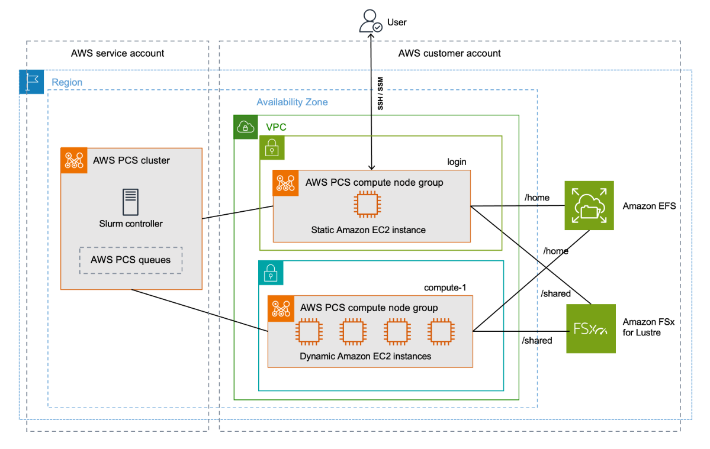

[nexus](https://robfatland.github.io/nexus), [index source](https://github.com/robfatland/nexus/blob/gh-pages/index.md), 
[nexus main](https://github.com/robfatland/nexus/tree/main)

# high performance computing

This topic typically presumes multiple computers networked together with very low communication latency, 
effecting a supercomputer.

The following link needs follow-through: AWS org, HPC services, etcetera...

### AWS Parallel Computing Service PCS

     
- [AWS PCS intro](https://www.youtube.com/watch?v=ciHU2fDzhSc)
- Slurm controller
- Two node groups
    - 

