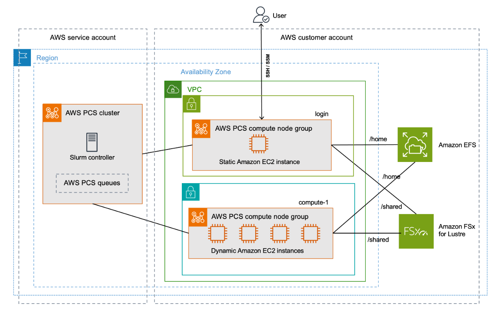

[nexus](https://robfatland.github.io/nexus), [index source](https://github.com/robfatland/nexus/blob/gh-pages/index.md), 
[nexus main](https://github.com/robfatland/nexus/tree/main)

# high performance computing

> **Conceptual overview.** For hands-on cloud HPC setup, see the MSE544 labs and vendor documentation linked below.
> See also: [supercomputing.ipynb](https://github.com/robfatland/nexus/blob/gh-pages/hpc/supercomputing.ipynb) — working notebook with Hyak commands, CNN checkpointing, and CIFAR-10 examples.

**TODO:** Get links to MSE544 cloud infrastructure topic labs for HPC cluster setup.

We oversimplify High Performance Computing to mean: Multiple computers networked together with very 
low communication latency creating in effect a supercomputer. How is this done on prem? How is it 
done on the three primary cloud platforms? 

### uw on-premise hpc

This will be a slightly abstracted description of working on facilities at the University of Washington.

- Get white listed with access to Klone, Tillicum and Kopah
    - Respectively HPC blades, GPU sysytems, and S3-style object storage
    - Follow instructions to get MFA 
- `ssh NetID@klone.hyak.uw.edu`
    - This is the login node (not necessarily where work gets done)

### AWS Parallel Computing Service PCS

- [AWS PCS introduction / overview video](https://www.youtube.com/watch?v=ciHU2fDzhSc)
- Slurm controller
- Login node group
- Compute node group

### Azure

> Stub. Azure CycleCloud and Azure Batch are the primary HPC services. Documentation needed.

### GCP

> Stub. Google Cloud HPC Toolkit and Batch are the primary services. Documentation needed.

## Hyak Burst to Cloud

Notes from a planning conversation (05-DEC-2024) on bursting Hyak jobs to AWS.

**Attendees:** Kristen Finch (UW IT RC), Xiao Zhu (UW IT RC), David Sinn (UW IT network), Rob Fatland (UW IT/eScience), Adam (AWS SA/network), Scott Friedman (AWS SA), Jeff Williams (AWS PM)

**Concept:** A user submits a job to Slurm which decides where to run it. Bursting points at a queue where jobs run in the cloud. VMs are provisioned on demand from an AMI built to look like an on-prem node.

**Key points:**
- Scott has an open-source Python plugin that interprets Slurm directives into AWS activity
- AMI generation is injected as a step whenever an on-prem image is generated
- Internet access: Typically via NAT Gateway on AWS
- Network options discussed: IPSEC tunnels (fastest to set up), DirectConnect ports (exist today, need training), PNWGigapop partnership path
- Current priority: Working proof-of-concept; tunnel is fine for now

