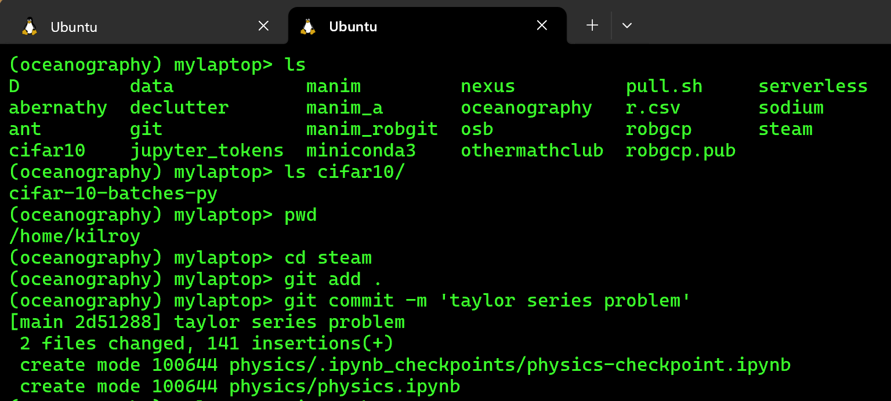

[nexus](https://robfatland.github.io/nexus), [index source](https://github.com/robfatland/nexus/blob/gh-pages/index.md), 
[nexus main](https://github.com/robfatland/nexus/tree/main)




# nexus

nexus is a threefold documentation resource for open research: native, external (via pointers, usually URLs), and hybrid. 
Hybrid documentation is commentary produced by writing up notes whilst working through an external resource such as a 
tutorial. This is intended to fill context gaps, note gotchas and so on: Make the path easier to follow.


This (gh-pages-branch) source file is [`index.md`](https://github.com/robfatland/nexus/blob/gh-pages/index.md)).


- [published: nexus](https://robfatland.github.io/nexus) ~ [editable `index.md`](https://github.com/robfatland/nexus/blob/gh-pages/index.md)
- [published: lexicon](https://robfatland.github.io/nexus/lexicon) ~ [editable `lexicon.md`](https://github.com/robfatland/nexus/blob/gh-pages/lexicon.md)


## Topics


* [bash and related](https://robfatland.github.io/nexus/bash/), [source](https://github.com/robfatland/nexus/blob/gh-pages/bash/index.md)
    * [environments](https://robfatland.github.io/nexus/env), [source](https://github.com/robfatland/nexus/blob/gh-pages/env/index.md)
    * [git and GitHub](https://robfatland.github.io/nexus/git), [source](https://github.com/robfatland/nexus/blob/gh-pages/git/index.md)
    * [wrenching the terminal](https://robfatland.github.io/nexus/terminal), [source](https://github.com/robfatland/nexus/blob/gh-pages/bash/terminal.md)
    * [ssh tunnels](https://robfatland.github.io/nexus/bash/tunnels), [source](https://github.com/robfatland/nexus/blob/gh-pages/bash/tunnels.md)
* [data security](https://cloudmaven.github.io/documentation/cc_data_security.html)
* [artificial intelligence](https://robfatland.github.io/nexus/ai/), [source](https://github.com/robfatland/nexus/blob/gh-pages/ai/index.md)
* [cloud infrastructure](https://robfatland.github.io/nexus/cloud/), [source](https://github.com/robfatland/nexus/blob/gh-pages/cloud/index.md)
* [documentation](), [sphinx](),
[sphinx with python](https://kanishkvarshney.medium.com/python-documentation-generating-html-using-sphinx-a0d909f5e963),
[python packages](), [flameshot](), [LaTeX](), [Hugo](), [Jekyll]()


## Reminders on other simple little topics...

### Follow this up

How do I log in to another machine using `ssh` and `path/keypair.pem`?

```
> ssh -i path/keypair.pem username@123.123.123.123
```

### Follow this up

Q: When do I want to write a class in Python? (In Java everything is a class.)

A: When the object is something that has a state that you need to access at a later time. 

A2: If your functions call other functions you have written and you want to have future users swap those functions out. Like the ML metric function. You are using subclasses to replace old methods with new methods. 

### Follow this up


`sudo apt-get install -y nyancat`


...and a remark on the mechanics, separation of concerns, Ohm's law, that sort of thing


### Follow this up


save a file called `r.csv` with contents

```
row,a,b,c
1,3,3,3
2,4,2,3
3,5,1,4
```

issue:


```
import pandas as pd
q=pd.read_csv('../../../r.csv')
q
```

### Follow up CPU monitoring (many-core machine)


Wes says: "Use **`top`** from the bash command line."


Wes says: "CloudWatch metrics (AWS EC2 console GUI) are delayed, updated once every 5 minutes.
A localized spike in CPU use will take some time to display in the console. It is possible 
to pay for a higher sampling rate in the console... but why?"


### Keep a VM patched

```
sudo apt-get update -y && sudo apt-get upgrade -y
```

alternative...?...

```
sudo apt update
sudo apt install
```

# residual remarks from gh-pages README

- The `lexicon.md` list of terms is relevant, needs a ton of work
- The file `index.md` is a compendium of useful recipes including the titular material on simplifying bash windows; more work here also
- What are the relevant related repos ***R3***?
    - `runawaytrain` has AWS Organizations and some API use; so very AWS-cloud-centric 
    - formerly `reorganiseduponthefloor` has `git` and more: to transplant
    - `cbburn` does have some pandas DataFrame manipulation
    - `digitaltwin` is itself
    - `serverless` is itself
    - Left Off Here


[This repo](https://github.com/robfatland/greenandblack/tree/main)
began as a Note To Self on simplifying format of the *Bourne again shell* **`bash`**: 
No colorized text, just green characters on a black background.


- this repo uses GitHub **pages** so switch to the **`gh-pages`** branch to edit content
- customizing `bash` and `vi` is focused on green-on-black, a simple prompt, and text editing
- scope expanded to include
    - **`ssh`** tunnels from one machine to another
    - Difference: **`miniconda`** versus **`anaconda`**
    - Windows PC
        - **`Ubuntu bash`**
        - **`Windows Subsystem for Linux (WSL-2)`**
        - **`VSCode`**?
    - containers
    - conda environments


