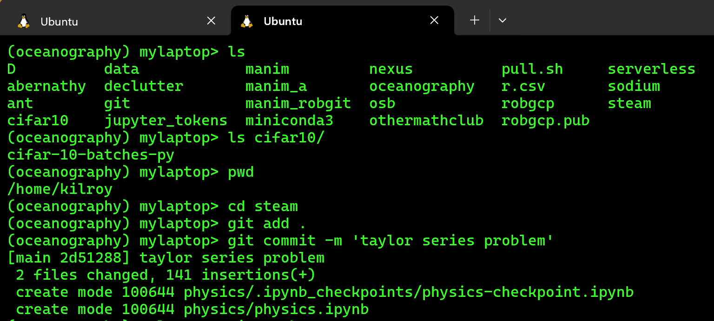

[nexus published](https://robfatland.github.io/nexus), [index source](https://github.com/robfatland/nexus/blob/gh-pages/index.md)

**nexus** is a *threefold documentation resource* centered on technology, tools and methods for 
open data science. Nexus is "How I Did It" notes in case I need to do it again in the future.
Content is threefold in the sense of: *native* plus *external* plus *hybrid* documentation. 
*Hybrid* is (native) commentary from working through (external) guides and tutorials.

## Interpreting the `nexus` content map 

Nexus is a 3-level tree of notes. Every page has a 'build' form which is all I really care about. 
However `nexus` also has a published `github pages` form with "published" URLs:
- [https://robfatland.github.io/nexus](https://robfatland.github.io/nexus) is the root i.e. tier 1
- [https://robfatland.github.io/nexus/bash](https://robfatland.github.io/nexus/bash) for tier 2 topics
- [https://robfatland.github.io/nexus/bash/git](https://robfatland.github.io/nexus/bash/git) for tier 3

### Structure of the toc

Keywords: A page's detailed focus.

- Nexus Tier 1 (this page)
    - Indent 1: Tier 1+ subtopics: A **lexicon** and **loose strands**
        - Indent 2: Tier 2 topics such as `bash` (`bash/index.md`) (keywords)
            - Indent 3: Tier 3 children such as `git` (`git/index.md`) (keywords)

### Content map

- [nexus root](https://github.com/robfatland/nexus/blob/gh-pages/index.md) (Level 1)
  - [lexicon](https://github.com/robfatland/nexus/blob/gh-pages/lexicon.md) (Level 1+: terse definitions of jargon)
  - [loose strands (TODO list)](https://github.com/robfatland/nexus/blob/gh-pages/loosestrands.md) (Level 1+: actionable gaps and tasks)
    - [bash](https://github.com/robfatland/nexus/blob/gh-pages/bash/index.md) (Level 2) (VM bootstrapping, miniconda, ssh tunnels, Linux basics)
        - [environments](https://github.com/robfatland/nexus/blob/gh-pages/bash/env.md) (Level 3: conda, venv, pip, import mechanics)
        - [wrenching the terminal](https://github.com/robfatland/nexus/blob/gh-pages/bash/terminal.md) (Level 3: green-on-black, .bashrc, vim)
        - [ssh tunneling](https://github.com/robfatland/nexus/blob/gh-pages/bash/tunneling.md) (Level 3: one-hop, two-hop, VSCode Server)
    - [git](https://github.com/robfatland/nexus/blob/gh-pages/git/index.md) (Level 2: gh-pages gotcha, basics, conflicts, advanced)
    - [data](https://github.com/robfatland/nexus/blob/gh-pages/data/index.md) (Level 2: stub)
        - [api](https://github.com/robfatland/nexus/blob/gh-pages/data/api.md) (Level 3: NoSQL API serverless Azure periodic table ocean science)
    - [hpc](https://github.com/robfatland/nexus/blob/gh-pages/hpc/index.md) (Level 2: UW Hyak, AWS PCS)
    - [cloud](https://github.com/robfatland/nexus/blob/gh-pages/cloud/index.md) (Level 2: VM login, VSCode, basics and links)
        - [spot market / preemptible](https://github.com/robfatland/nexus/blob/gh-pages/cloud/spot.md) (Level 3: 70-90% savings)
        - [studies](https://github.com/robfatland/nexus/blob/gh-pages/cloud/studies.md) (Level 3: SCOPED, Neotoma)
        - [aws Organizations](https://github.com/robfatland/nexus/blob/gh-pages/cloud/organizations.md) (Level 3)
        - [aws object storage](https://github.com/robfatland/nexus/blob/gh-pages/cloud/aws.md) (Level 3: S3, Mountpoint, Kopah)
        - [azure](https://github.com/robfatland/nexus/blob/gh-pages/cloud/azure.md) (Level 3: stub)
        - [azure OpenAI access](https://github.com/robfatland/nexus/blob/gh-pages/cloud/azure-openai-access.md) (Level 3: stub)
        - [gcp RStudio install](https://github.com/robfatland/nexus/blob/gh-pages/cloud/gcp.md) (Level 3: VM and Workstation)
    - [manim](https://github.com/robfatland/nexus/blob/gh-pages/manim/index.md) (Level 2: getting started with math animations)
    - [(meta-)documentation](https://github.com/robfatland/nexus/blob/gh-pages/documentation/index.md) (Level 2: flameshot, philosophy)
        - [markdown](https://github.com/robfatland/nexus/blob/gh-pages/documentation/markdown.md) (Level 3: formatting, LaTeX history)
        - [LaTeX in Jupyter](https://github.com/robfatland/nexus/blob/gh-pages/documentation/latex.md) (Level 3: consolidated reference — symbols, sizing, alignment, color)
    - [python](https://github.com/robfatland/nexus/blob/gh-pages/python/index.md) (Level 2: hashing, topics wish list)
        - [jupyter](https://github.com/robfatland/nexus/blob/gh-pages/python/jupyter.md) (Level 3: Littlest Hub, image display, directory listing)
        - [packages](https://github.com/robfatland/nexus/blob/gh-pages/python/packages.md) (Level 3: stub — apt, pip, conda, mamba, pixi)
    - [containers](https://github.com/robfatland/nexus/blob/gh-pages/containers/index.md) (Level 2: conceptual overview, Docker eigenconcepts)
    - [artificial intelligence](https://github.com/robfatland/nexus/blob/gh-pages/ai/index.md) (Level 2: eigenconcepts, HuggingFace, lecture notes)
        - [gcp](https://github.com/robfatland/nexus/blob/gh-pages/ai/gcp.md) (Level 3: Gemini/Vertex AI bootstrap)
        - [aws](https://github.com/robfatland/nexus/blob/gh-pages/ai/aws.md) (Level 3: EC2 + VS Code Server + Q Developer + Streamlit app + SageMaker)
        - [azure](https://github.com/robfatland/nexus/blob/gh-pages/ai/azure.md) (Level 3: stub)
    - [vscode](https://github.com/robfatland/nexus/blob/gh-pages/vscode/index.md) (Level 2: stub — links to VM connection procedures)

[Essay: Understanding the cloud-for-research time investment](https://github.com/robfatland/nexus/blob/gh-pages/bash/index.md#the-basic-idea-here)

## Why is nexus?

**nexus** is a response to the tech 'profusion/latency' problem faced by scientists who need a degree of
familiarity with computing infrastructure. The scientist is first a Builder and then a User where they
can focus on the actual research. Suppose a research team needs to puzzle out how to develop code for 
and then run a *lot* of compute tasks on a limited budget; so perhaps containerization and Jupyter Lab servers 
are pieces of the solution. Once set in place the *how to* can be forgotten... but *how to* invariably 
comes up again at some point down the road, be that weeks or months or a year. It is onerous and depressing 
to have to begin again as Builder *de novo*. Nichte diese Töne: `nexus` hopes to be helpful.

